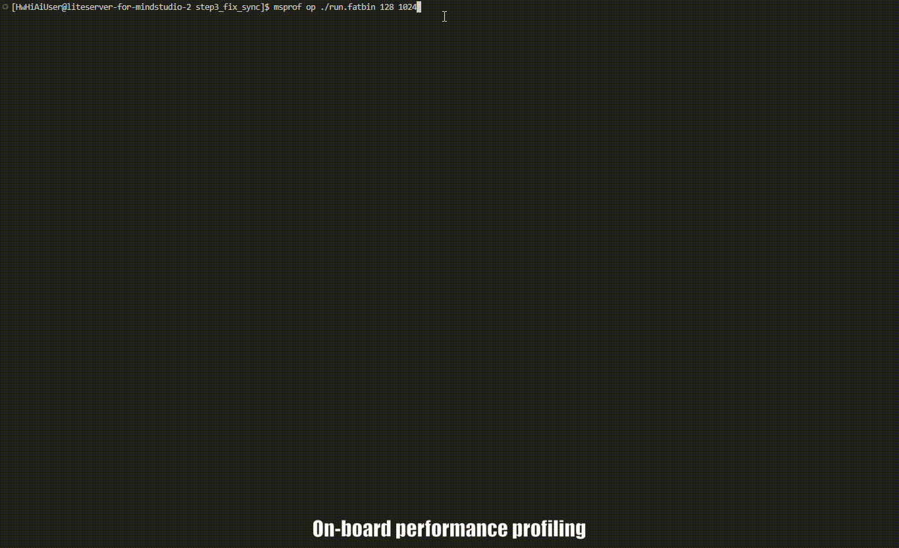

<h1 align="center">MindStudio Ops Profiler</h1>

<b>Ascend AI Operator Tuning Tool</b>

 
 
 
 
 
 

English | [简体中文](README.md)

## ✨ Latest Updates

🔹 **[Dec 31, 2025]**: MindStudio Ops Profiler is fully open-source.

## ️ ℹ️ Overview

MindStudio Ops Profiler (msOpProf, an operator tuning tool) is used to collect and analyze the key performance metrics of operators running on Ascend AI Processors. Based on the output profile data, you can quickly locate the hardware and software performance bottlenecks of operators, significantly improving the efficiency of operator performance analysis. Currently, profile data can be collected and automatically parsed in various running modes (real-device deployment or simulation) and input formats (executable files or operator binary .o files).

  <h4>▶️ Quick Demo</h4>
  
  
Figure: Deploying operators on the board and collecting profile data for simulation tuning

## ⚙️ Features

The tool provides two usage modes: msOpProf and msOpProf simulator.

| Feature| Description|
|---------|--------|
| **msOpProf mode**| It is suitable for performance analysis in the actual operating environment. You can directly analyze running operators without additional configuration, helping you quickly locate memory and performance bottlenecks of operators. This mode is especially suitable for the board environment.|
| **msOpProf simulator mode**| You need to configure environment variables and compilation options. This mode is suitable for detailed and in-depth performance analysis of operator behavior in the simulation environment.|

## 🚀 Quick Start

Quickly experience core functions. For details, see [msOpProf Quick Start](./docs/en/quick_start/msopprof_quick_start.md).

## 📦 Installation Guide

For msOpProf installation details, see the [msOpProf Installation Guide](./docs/en/install_guide/msopprof_install_guide.md).

## 📘 User Guide

For details about how to use the tool, see the [msOpProf User Guide](./docs/en/user_guide/msopprof_user_guide.md) or the [msOpProf Simulator User Guide](./docs/en/user_guide/msopprof_simulator_user_guide.md).

## 💡 Typical Cases

msOpProf helps you understand and use the tool through some typical cases. For specific cases, see [msOpProf Typical Cases](./docs/en/best_practices/typical_cases.md).

## 🌌 Intelligent Search

To improve documentation search efficiency, we provide multiple efficient search methods:  
🔹 [AI Q&A (DeepWiki)](https://deepwiki.com/mindstudio-docs/master): Natural language Q&A that helps you quickly grasp the project architecture and module relationships.   
🔹 [AI Q&A (ZRead)](https://zread.ai/mindstudio-docs/master): A better Chinese Q&A experience that precisely locates feature usage and details.   
🔹 [Precise Search (ReadTheDocs)](https://mindstudio-operator-tools-docs.readthedocs.io/zh-cn/latest/): Keyword-based full-text search that takes you directly to interfaces, parameters, and error messages.  

## 🛠️ Contribution Guide

You are welcome to contribute to the project. For details, see the [Contribution Guide](./docs/en/contributing/contributing_guide.md). 

## ⚖️ Related Information

🔹 [Release Notes](./docs/en/release_notes/release_notes.md)   
🔹 [License Notice](./docs/en/legal/license_notice.md)   
🔹 [Security Statement](./docs/en/legal/security_statement.md)   
🔹 [Disclaimer](./docs/en/legal/disclaimer.md) 

## 🤝 Suggestions and Communication

You are welcome to contribute to the community. If you have any questions or suggestions, please submit [issues](https://gitcode.com/Ascend/msopprof/issues). We will reply as soon as possible. Thank you for your support.

|Instant Interaction (WeChat Group)|Official Information (WeChat Official Account)|In-Depth Support (Assistant/Forum)|
|:---:|:---:|:---:|
|  *Scan the QR code to join the technical communication group.* |  *Scan the QR code to follow the official WeChat account.* | Scan the QR code to join the group and follow the official account to access the fastest communication platform for MindStudio users and developers:  **Quick questions:** Discuss technical issues with community members in real time. **Stay informed:** Receive version release and feature update notifications as soon as they are published.  **Share experience:** Exchange best practices and hands-on insights with a wide range of developers.      **More support channels:** 👉 Ascend Assistant:  👉 Ascend Forum:  |

## 🙏 Acknowledgements

This tool is jointly developed by the following Huawei departments:   
🔹 Ascend Computing MindStudio Development Department   
🔹 Ascend Computing Ecosystem Enablement Department   
🔹 Huawei Cloud AI Compute Service  
🔹 Compiler Technologies Lab, 2012 Labs  
🔹 Markov Lab, 2012 Labs   
Thank you to everyone in the community for your PRs. We warmly welcome your contributions.
