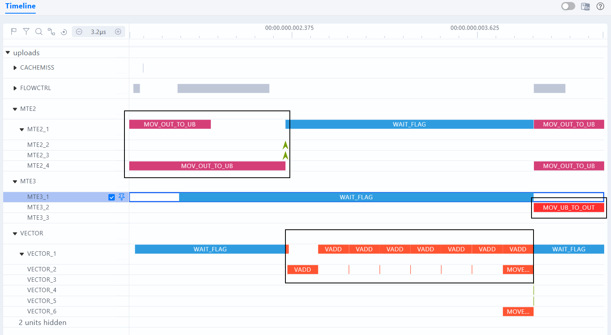
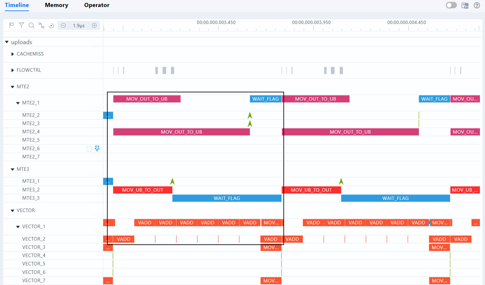

# VectorAdd 流水并行优化案例

## 概述

本样例演示如何使用 **msOpProf** 工具定位计算与数据搬运串行执行的性能瓶颈，并通过使能 DoubleBuffer（`BUFFER_NUM` 从 1 改为 2）实现流水并行，让 数据搬运 与 VEC 计算重叠执行。

## 适用场景

- 算子端到端耗时高，计算与数据搬运串行执行，流水线单元之间存在等待。
- VEC 计算时间与 MTE2 搬运时间可比拟时，DoubleBuffer 流水重叠收益显著。

## 支持的产品范围

- Ascend 950PR/Ascend 950DT
- Atlas A3 训练系列产品/Atlas A3 推理系列产品
- Atlas A2 训练系列产品/Atlas A2 推理系列产品

## 目录结构

```text
├── sample_double_buffer/
│   ├── CMakeLists.txt              // 编译工程文件
│   ├── double_buffer.asc           // Ascend C 算子实现（优化前版本）
│   ├── optimize.diff               // 优化前->优化后的 patch 文件
│   ├── images/                     // 仿真流水图
│   │   ├── pipeline_sim_before.png // 优化前仿真流水图（串行无重叠）
│   │   └── pipeline_sim_after.png  // 优化后仿真流水图（流水重叠）
│   └── README.md                   // 本说明文件
```

## 样例描述

### 核心逻辑

本样例实现向量加法算子 `y[i] = x[i] + bias[i]`，数据规模为 80M 个 half 元素（160 MB），8 核并行处理。算子内部按 `TILE_LENGTH` 粒度循环执行 DataCopy→Add→DataCopy，其中 Compute 阶段重复执行 8 次 Add 以增大 VEC 计算量。

每个核分配 3 个 UB buffer 队列（inQueueX、inQueueBias、outQueueY），每个队列包含 `BUFFER_NUM` 个 buffer，每个 buffer 大小为 `TILE_LENGTH * sizeof(half)` 字节，总 UB 占用 = `3 * BUFFER_NUM * TILE_LENGTH * 2` 字节。

> **说明**：本案例重在性能优化演示，不包含标杆数据生成和精度校验步骤，数据规模可以核间均分，不涉及尾核处理。示例代码省略了 ACL Runtime API（如 aclInit、aclrtMalloc、aclrtSynchronizeStream）的返回值检查，生产环境应补充错误处理与资源释放。

### 优化改动

优化前 `BUFFER_NUM = 1`，计算与搬运串行执行；优化后 `BUFFER_NUM = 2`，Ascend C编程范式自动实现 Ping/Pong 流水重叠，`Process()` 代码无需修改。

完整改动见 `optimize.diff`，仅修改两行常量定义：

```diff
-constexpr uint32_t TILE_LENGTH = 20480;
-constexpr uint32_t BUFFER_NUM = 1;
+constexpr uint32_t TILE_LENGTH = 10240;
+constexpr uint32_t BUFFER_NUM = 2;
```

## 编译运行

### 环境准备

请参照官方文档完成开发环境配置：[算子工具开发环境安装指导](https://gitcode.com/Ascend/msot/blob/master/docs/zh/common/dev_env_setup.md)。

### 编译算子

在 `sample_double_buffer/` 目录下执行：

```bash
mkdir -p build && cd build
cmake .. -DCMAKE_ASC_ARCHITECTURES=dav-2201
make -j4
cd ..
```

编译完成后，`build` 目录下生成 `demo` 可执行文件。

```bash
# 以 sim 模式重新编译（与上板 npu 产物分开，建议使用独立 build 目录）
mkdir -p buildsim && cd buildsim
cmake .. -DCMAKE_ASC_ARCHITECTURES=dav-2201 -DCMAKE_ASC_RUN_MODE=sim
make -j4 && cd ..
```

- 编译选项说明

| 选项 | 可选值 | 说明 |
|------|--------|------|
| `CMAKE_ASC_ARCHITECTURES` | `dav-2201`、`dav-3510` | NPU 架构：dav-2201 对应 Atlas A2/A3 系列产品，dav-3510 对应 Ascend 950PR/Ascend 950DT |
| `CMAKE_ASC_RUN_MODE` | `npu`（默认）、`sim`、`cpu` | 运行模式：`npu` 上板运行；`sim` 仿真运行（`msopprof simulator` 需用此模式产物）；`cpu` CPU 调试 |

> **注意**：切换架构或运行模式前需清理 cmake 缓存，可在 build 目录下执行 `rm CMakeCache.txt` 后重新 cmake。运行 `msopprof simulator` 仿真前，需以 `-DCMAKE_ASC_RUN_MODE=sim` 重新编译，默认 `npu` 模式产物无法用于仿真。

### 算子运行与性能采集

#### 优化前：采集基线数据

```bash
msopprof ./build/demo 0
```

命令执行后在当前目录生成 `OPPROF_{timestamp}_XXX/` 文件夹，包含以下 CSV 文件：

```text
OPPROF_{timestamp}_XXX/
├── OpBasicInfo.csv             // 算子基本信息（名称、核数、总耗时、频率）
├── PipeUtilization.csv         // 各流水线单元耗时和占比
├── ArithmeticUtilization.csv   // Cube/Vector 指令 cycle 占比和计算量
├── Memory.csv                  // 内存读写带宽和数据搬运量
├── MemoryL0.csv                // L0A/L0B/L0C 读写带宽
├── MemoryUB.csv                // UB 读写带宽（Vector/Scalar）
├── L2Cache.csv                 // L2 Cache 命中率
├── ResourceConflictRatio.csv   // Bank conflict 和资源冲突占比
└── visualize_data.bin          // MindStudio Insight 可视化文件
```

采集仿真流水数据（无需上板，用于生成流水仿真图）。

```bash
# 设置仿真器动态库路径（按实际 CANN 安装位置与 SOC 版本调整）
export LD_LIBRARY_PATH="${ASCEND_HOME_PATH}/tools/simulator/Ascend910B4/lib:${LD_LIBRARY_PATH}"

# 运行仿真（--soc-version 指定仿真芯片型号）
# 注：仿真运行时间较长，本演示案例可在运行一段时间后按一次Ctrl-C停止运行，仿真会在此基础上解析数据
msopprof simulator ./buildsim/demo 0 --soc-version Ascend910B4
```

#### 优化前：分析性能瓶颈

重点查看以下 CSV 文件中的关键字段：

| 文件 | 关键字段 | 说明 |
|------|---------|------|
| `OpBasicInfo.csv` | `Task Duration(us)` | 记录端到端耗时作为基线 |
| `OpBasicInfo.csv` | `Block Dim` | 确认多核已启用 |
| `OpBasicInfo.csv` | `Current Freq / Rated Freq` | 排除降频干扰 |
| `PipeUtilization.csv` | `aiv_time(us)` | 单核 AIV 执行时间 |
| `PipeUtilization.csv` | `aiv_mte2_ratio` | MTE2（GM→UB）占比 |
| `PipeUtilization.csv` | `aiv_mte3_ratio` | MTE3（UB→GM）占比 |
| `PipeUtilization.csv` | `aiv_vec_ratio` | Vector 指令 cycle 占比 |
| `PipeUtilization.csv` | `aiv_mte2_time(us)` | MTE2 耗时，与 VEC 耗时对比评估流水重叠潜力 |
| `PipeUtilization.csv` | `aiv_mte3_time(us)` | MTE3 耗时，与 VEC 耗时对比评估流水重叠潜力 |
| `PipeUtilization.csv` | `aiv_vec_time(us)` | VEC 耗时，与 MTE2/MET3 耗时对比评估流水重叠潜力 |
| `ResourceConflictRatio.csv` | `aiv_vec_wait_ratio` | Vector 等待占比 |
| `ResourceConflictRatio.csv` | `aiv_mte2_wait_ratio` | MTE2 等待占比 |
| `ResourceConflictRatio.csv` | `aiv_mte3_wait_ratio` | MTE3 等待占比 |
| `ResourceConflictRatio.csv` | `aiv_vec_mte_cflt_ratio` | MTE 冲突占比 |
| `Memory.csv` | `aiv_mte2_instructions` | MTE2 指令条数 |
| `Memory.csv` | `aiv_mte3_instructions` | MTE3 指令条数 |
| `Memory.csv` | `GM_to_UB_datas(KB)` | GM→UB 总搬运量 |
| `Memory.csv` | `UB_to_GM_datas(KB)` | UB→GM 总搬运量 |
| `Memory.csv` | `GM_to_UB_bw_usage_rate(%)` | GM→UB 带宽利用率 |
| `Memory.csv` | `UB_to_GM_bw_usage_rate(%)` | UB→GM 带宽利用率 |
| `Memory.csv` | `aiv_gm_to_ub_bw(GB/s)` | GM→UB 实际带宽 |
| `Memory.csv` | `aiv_ub_to_gm_bw(GB/s)` | UB→GM 实际带宽 |

**实测优化前关键指标**：

| 指标 | 优化前实测值 | 说明 |
|------|------------|------|
| `Task Duration(us)` | 1378.09 | 端到端耗时 |
| `Block Dim` | 8 | 8核并行 |
| `Current Freq / Rated Freq` | 1650 / 1650 | 满频运行，无降频 |
| `aiv_time(us)`（单核） | 1363.14 ~ 1377.46 | 各核执行时间 |
| `aiv_mte2_ratio` | 36.85% ~ 37.49% | MTE2（GM→UB）占比 |
| `aiv_mte3_ratio` | 14.55% ~ 15.30% | MTE3（UB→GM）占比 |
| `aiv_vec_ratio` | 61.28% ~ 61.92% | Vector 计算占比高 |
| `aiv_mte2_time(us)`（单核） | 502.30 ~ 516.39 | MTE2 耗时 |
| `aiv_mte3_time(us)`（单核） | 198.60 ~ 209.14 | MTE3 耗时 |
| `aiv_vec_time(us)`（单核） | 844.04 | VEC 耗时，大于 MTE2 耗时，计算主导 |
| `aiv_vec_wait_ratio` | 44.91% ~ 45.46% | Vector 等待占比高，计算与搬运串行 |
| `aiv_mte2_wait_ratio` | 99.81% ~ 99.83% | MTE2 等待占比高 |
| `aiv_mte3_wait_ratio` | 99.61% ~ 100.55% | MTE3 等待占比高 |
| `aiv_vec_mte_cflt_ratio` | 0.00% | 无 MTE 冲突 |
| `aiv_mte2_instructions`（单核） | 1025 | MTE2 指令条数 |
| `aiv_mte3_instructions`（单核） | 513 | MTE3 指令条数 |
| `GM_to_UB_datas(KB)` | 40960.00 | GM→UB 总搬运量（单核） |
| `UB_to_GM_datas(KB)` | 20480.00 | UB→GM 总搬运量（单核） |
| `GM_to_UB_bw_usage_rate(%)` | 12.89% ~ 13.02% | GM→UB 带宽利用率 |
| `UB_to_GM_bw_usage_rate(%)` | 7.59% ~ 7.67% | UB→GM 带宽利用率 |
| `aiv_gm_to_ub_bw(GB/s)` | 28.36 ~ 28.66 | GM→UB 实际带宽 |
| `aiv_ub_to_gm_bw(GB/s)` | 14.18 ~ 14.33 | UB→GM 实际带宽 |

分析结论：`BUFFER_NUM = 1` 时计算与搬运串行执行，`aiv_vec_wait_ratio` 约 45%，VEC 计算单元近半时间在等待数据搬入完成。

优化前仿真流水图（MTE2→VEC→MTE3 串行执行，无流水重叠）：



#### 应用优化并重新采集

```bash
# 应用优化 patch
patch -p1 < optimize.diff

# 重新编译（同一 build 目录，保持 sim 模式）
cd build && make -j4 && cd ..

# 采集优化后数据
msopprof ./build/demo 0

# 采集优化后仿真流水数据（用于生成流水仿真图）
export LD_LIBRARY_PATH="${ASCEND_HOME_PATH}/tools/simulator/Ascend910B4/lib:${LD_LIBRARY_PATH:-}"
msopprof simulator ./build/demo 0 --soc-version Ascend910B4
```

#### 优化后：对比验证

**实测优化后关键指标**：

| 指标 | 优化前 | 优化后 | 对比结论 |
|------|-------:|-------:|---------|
| `Task Duration(us)` | 1378.09 | 959.62 | **30.4% 提升，1.44x 加速** |
| `Block Dim` | 8 | 8 | 核数不变 |
| `Current Freq / Rated Freq` | 1650 / 1650 | 1650 / 1650 | 满频运行，无降频 |
| `aiv_time(us)`（单核） | 1363.14 ~ 1377.46 | 932.54 ~ 959.01 | 单核时间显著下降 |
| `aiv_mte2_ratio` | 36.85% ~ 37.49% | 82.60% ~ 85.20% | MTE2 占比大幅上升，搬运更密集 |
| `aiv_mte3_ratio` | 14.55% ~ 15.30% | 25.16% ~ 27.54% | MTE3 占比上升 |
| `aiv_vec_ratio` | 61.28% ~ 61.92% | 92.65% ~ 95.21% | VEC 占比大幅上升，计算更密集 |
| `aiv_mte2_time(us)`（单核） | 502.30 ~ 516.39 | 770.25 ~ 816.59 | MTE2 时间增加，TILE 减半 DataCopy 调用翻倍 |
| `aiv_mte3_time(us)`（单核） | 198.60 ~ 209.14 | 234.65 ~ 263.81 | MTE3 时间增加，同上 |
| `aiv_vec_time(us)`（单核） | 844.04 | 887.90 ~ 888.56 | VEC 时间略增，TILE 减半 |
| `aiv_vec_wait_ratio` | 44.91% ~ 45.46% | 6.25% ~ 9.63% | **大幅下降，VEC 与 搬运 流水重叠生效** |
| `aiv_mte2_wait_ratio` | 99.81% ~ 99.83% | 99.59% ~ 99.60% | 基本不变 |
| `aiv_mte3_wait_ratio` | 99.61% ~ 100.55% | 99.55% ~ 99.86% | 基本不变 |
| `aiv_vec_mte_cflt_ratio` | 0.00% | 0.00% | 无 MTE 冲突 |
| `aiv_mte2_instructions`（单核） | 1025 | 2049 | GM→UB 指令翻倍（TILE 减半） |
| `aiv_mte3_instructions`（单核） | 513 | 1025 | UB→GM 指令翻倍 |
| `GM_to_UB_datas(KB)` | 40960.00 | 40960.00 | 总搬运量不变 |
| `UB_to_GM_datas(KB)` | 20480.00 | 20480.00 | 总搬运量不变 |
| `GM_to_UB_bw_usage_rate(%)` | 12.89% ~ 13.02% | 18.51% ~ 19.03% | 带宽利用率提升，搬运更密集 |
| `UB_to_GM_bw_usage_rate(%)` | 7.59% ~ 7.67% | 10.90% ~ 11.21% | 带宽利用率提升 |
| `aiv_gm_to_ub_bw(GB/s)` | 28.36 ~ 28.66 | 40.73 ~ 41.89 | 实际带宽提升 |
| `aiv_ub_to_gm_bw(GB/s)` | 14.18 ~ 14.33 | 20.37 ~ 20.94 | 实际带宽提升 |

优化后仿真流水图（Ping/Pong 双 buffer，MTE2 与 VEC 流水重叠执行）：



#### 恢复源码

```bash
patch -R -p1 < optimize.diff
```

### 性能调优总结

| 优化前现象 | 调优动作 | 原因 |
|-----------|---------|------|
| 计算与搬运串行执行，`aiv_vec_wait_ratio` ≈ 45%，VEC 近半时间等待 MTE2 完成 | 将 `BUFFER_NUM` 从 1 改为 2 使能 DoubleBuffer，同时 `TILE_LENGTH` 从 20480 减半至 10240（总 UB 占用不变） | DoubleBuffer 使 TQue 分配 Ping/Pong 双 buffer，EnQue/DeQue 机制自动实现搬运与计算流水重叠，`aiv_vec_wait_ratio` 从 45% 降至 ~8% |

> **注意**：DoubleBuffer 的收益取决于 VEC 与 MTE2 耗时的可比性。本案例通过 Compute 阶段重复 8 次 Add 使 VEC 耗时（~844 us）与 MTE2 耗时（~510 us）达到可比拟量级，流水重叠后 Task Duration 从 1378 us 降至 960 us，加速 1.44x。若 VEC 耗时远小于 MTE2（如单次 Add），流水重叠收益有限。

### 注意事项

1. 上板功能需要真实 NPU 环境，编译出的二进制应在目标设备上运行。
2. 本案例环境为 Ascend 910B4 + CANN 9.1.0-beta.3，数据因环境不同可能会有差异，属于正常现象。
