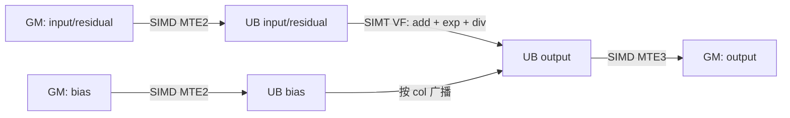
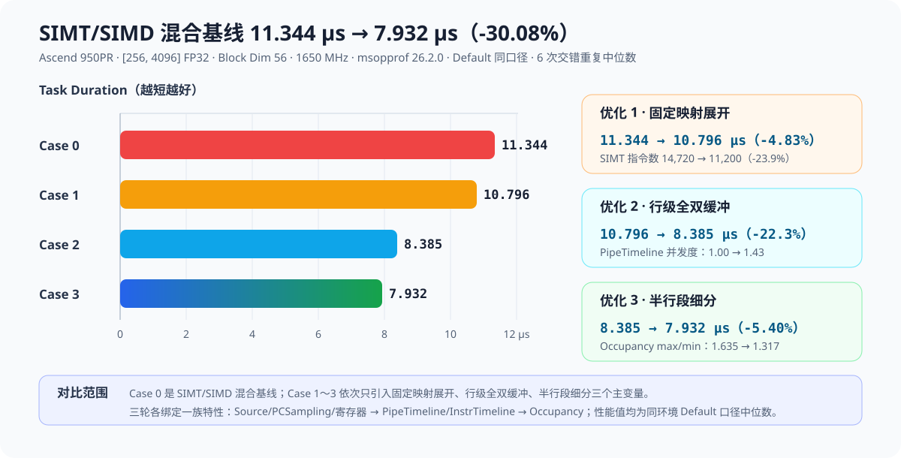
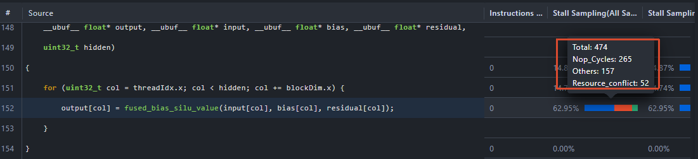
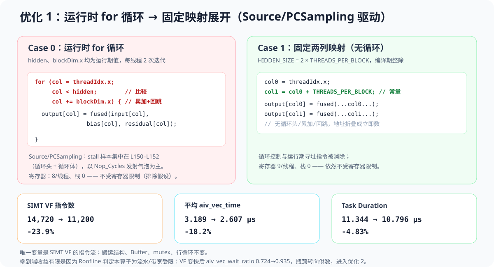
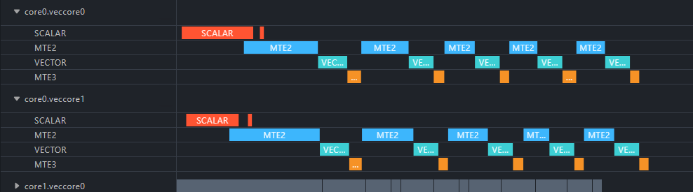
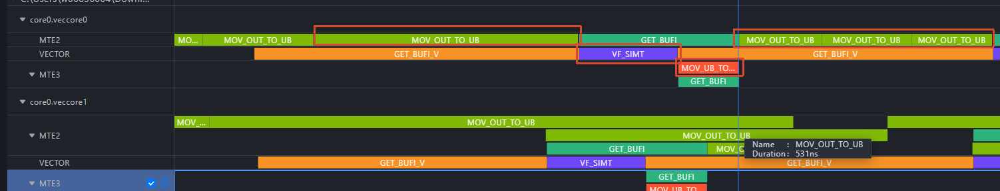
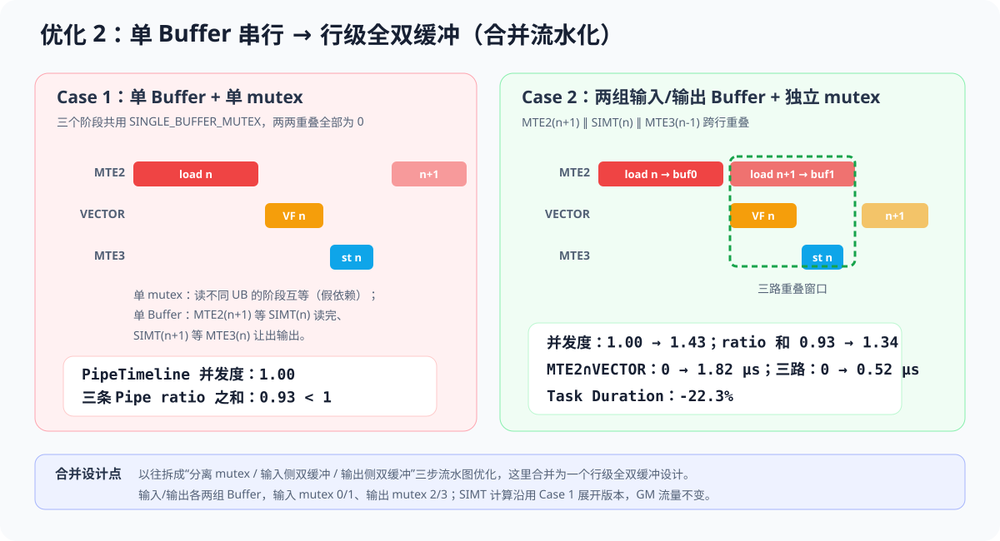
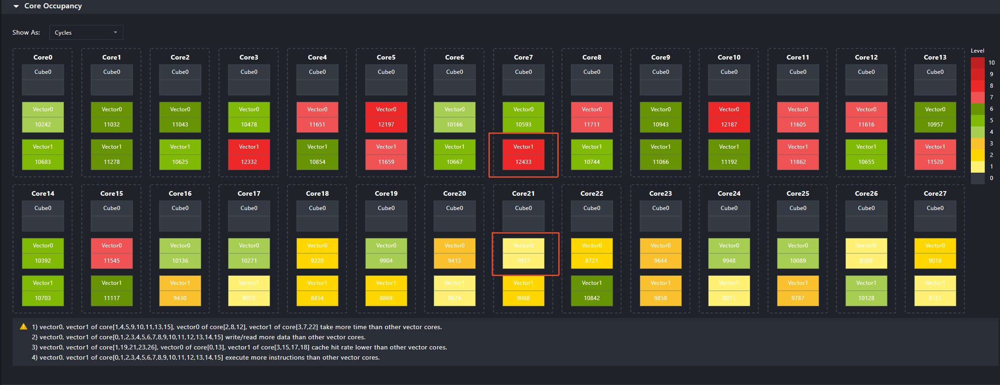
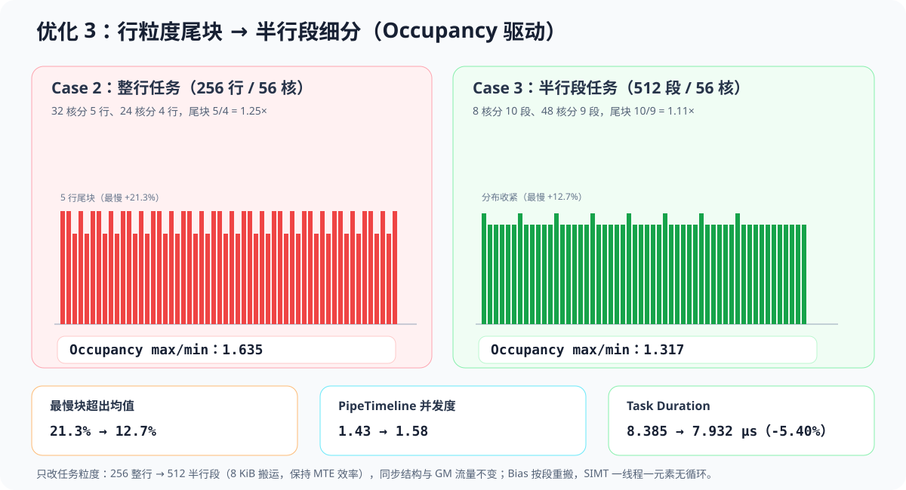

# SIMT+SIMD 融合算子上板优化分析案例（Bias + SiLU + Residual）

## 案例说明

本案例面向 Ascend 950（A5，`dav-3510`），以 Bias + SiLU + Residual 融合算子为例，演示如何用 `msopprof` 上板性能采集，逐步定位并优化 SIMT+SIMD 融合算子的瓶颈。算子数据通路为：MTE2 将 GM 数据搬入 UB，SIMT VF 在 UB 内完成逐元素融合计算，MTE3 将结果连续搬回 GM。计算公式为：

```text
value[row, col]  = input[row, col] + bias[col]
output[row, col] = residual[row, col]
                 + value[row, col] / (1 + exp(-value[row, col]))
```

第一轮从 Source/PCSampling 出发削减 SIMT 指令开销；第二轮从 PipeTimeline/InstrTimeline 出发做流水化；第三轮从 Occupancy 核间负载出发收敛尾块。Case 0～3 已完成上板采集：

| Case | 核函数                                   | 本步引入的变化                                                                                         | 输出二进制                |
| ---- | ---------------------------------------- | ------------------------------------------------------------------------------------------------------ | ------------------------- |
| 0    | `fused_bias_silu_ub_kernel`            | 初始                                                                                                   | `fused_bias_silu_case0` |
| 1    | `fused_bias_silu_unroll_kernel`        | SIMT VF 改为固定两列映射（`col0/col1` 编译期确定），消除循环控制与运行期寻址；流水结构不变           | `fused_bias_silu_case1` |
| 2    | `fused_bias_silu_row_db_kernel`        | 行级全双缓冲：输入/输出各两组 Buffer、独立 mutex，MTE2(n+1)∥SIMT(n)∥MTE3(n-1) 跨行重叠（合并流水化） | `fused_bias_silu_case2` |
| 3    | `fused_bias_silu_double_buffer_kernel` | 任务从整行细分为半行段（2,048 元素），在途任务数翻倍，收敛核间尾块                                     | `fused_bias_silu_case3` |

其中 `core` 为硬件 vector core 数（本环境为 56）。每个 Thread Block 启动 2048 线程；输入由二进制内部生成，所有 Case 共用同一 Host Golden 和误差阈值，不通过改变精度换性能。

输入规模：

```text
input       [256, 4096]  float32  ND
bias        [4096]       float32  ND，在所有 row 间共享
residual    [256, 4096]  float32  ND
output      [256, 4096]  float32  ND
```

融合实现中的分工如下：



- SIMD 侧负责连续 GM↔UB 搬运、mutex 同步和双缓冲调度。
- SIMT VF 侧负责逐元素 Bias、SiLU 和 Residual 融合计算。

## 编译运行

### 环境准备

请参照官方文档完成开发环境配置：[算子工具开发环境安装指导](https://gitcode.com/Ascend/msot/blob/master/docs/zh/common/dev_env_setup.md)。

### 编译算子

编译 Case 3（最新优化版）：

```bash
./build.sh 3
```

`build.sh` 参数顺序不敏感：

```text
./build.sh [0|1|2|3|all] [dav-3510] [npu|sim]
```

本案例默认运行模式为 `npu`，默认架构为 `dav-3510`。每个 Case 独立输出到 `build/case<N>_<run_mode>_<arch>/`，互不覆盖，便于对比采集。`build.sh` 以脚本自身目录为基准，因此可以从仓库根目录或其他工作目录调用，不会误用调用者目录下的 `CMakeLists.txt` 或 `build/`。

`CMakeLists.txt` 已为 ASC 源打开 `-g`，它是 Source/PCSampling/InstrTimeline 做 PC↔源码映射的前提。

### 算子运行

#### 拉起算子

程序通过编译期常量 [`DEVICE_ID`（L34）](fused_bias_silu.asc) 选择设备（如需切换设备请修改该常量后重新编译）；二进制后的位置参数是 `rows`，不是设备号：

```bash
./build/case3_npu_dav-3510/fused_bias_silu_case3 256
```

成功标志：

```text
[Success] Accuracy verification passed.
```

以下命令均在样例根目录执行：

```bash
# 第一轮（Case 0→1）：Source + PCSampling 看 SIMT 热点与 stall，配合 -g 做 PC↔源码映射
msopprof --aic-metrics=PCSampling,Roofline,Occupancy,Default ./build/case0_npu_dav-3510/fused_bias_silu_case0 256
msopprof --aic-metrics=PCSampling,Roofline,Occupancy,Default ./build/case1_npu_dav-3510/fused_bias_silu_case1 256

# 第二轮（Case 1→2）：PipeTimeline 直接观察三条 Pipe 的重叠变化（rows=256 才有跨行重叠可看）
msopprof --aic-metrics=PipeTimeline,Roofline,Occupancy,Default ./build/case1_npu_dav-3510/fused_bias_silu_case1 256
msopprof --aic-metrics=PipeTimeline,Roofline,Occupancy,Default ./build/case2_npu_dav-3510/fused_bias_silu_case2 256

# 第二轮补充：InstrTimeline 下钻指令级执行区间（rows=32 控制 DBI 插桩规模）
msopprof --aic-metrics=InstrTimeline,Roofline,Occupancy,Default ./build/case1_npu_dav-3510/fused_bias_silu_case1 32
msopprof --aic-metrics=InstrTimeline,Roofline,Occupancy,Default ./build/case2_npu_dav-3510/fused_bias_silu_case2 32

# 第三轮（Case 2→3）：对比行级与半行段双缓冲，PipeTimeline 看重叠、InstrTimeline 看指令交错
msopprof --aic-metrics=PipeTimeline,Roofline,Occupancy,Default ./build/case2_npu_dav-3510/fused_bias_silu_case2 256
msopprof --aic-metrics=PipeTimeline,Roofline,Occupancy,Default ./build/case3_npu_dav-3510/fused_bias_silu_case3 256
msopprof --aic-metrics=InstrTimeline,Roofline,Occupancy,Default ./build/case2_npu_dav-3510/fused_bias_silu_case2 32
msopprof --aic-metrics=InstrTimeline,Roofline,Occupancy,Default ./build/case3_npu_dav-3510/fused_bias_silu_case3 32
```

几个 `rows` 与特性组合的分工需要说明：

- InstrTimeline 用 `rows=32` 控制 DBI 插桩规模；其 Task Duration 含插桩开销，不参与性能横向比较。
- Source/PCSampling 在 Ascend 950 上属于低开销采样，但其采集配置下 Block 数会被压缩（本例实测为 32 Block），因此它的价值在于“热点落在哪些源码行、stall 属于哪一类”，绝对耗时以 Default 口径为准。

#### 查看采集结果

按下表逐项查看每个 Case 的采集结果，即可复现整条优化路径的判断依据：

| 文件                             | 观察目标                                                                                 |
| -------------------------------- | ---------------------------------------------------------------------------------------- |
| `OpBasicInfo.csv`              | `Task Duration`、`Block Dim`                                                         |
| `PipeUtilization.csv`          | AIV 总时间、`vec`/`scalar`/`mte2`/`mte3` 各流水耗时与占比                        |
| `ResourceConflictRatio.csv`    | 各流水`wait_ratio`（本例 SIMT VF 的 `stu/ldu/sfu_cflt` 均为 0，不是主要矛盾）        |
| `Memory.csv`、`MemoryUB.csv` | GM/UB 读写带宽与数据搬运量                                                               |
| `L2Cache.csv`                  | L2 读写命中率                                                                            |
| `visualize_data.bin`           | Roofline 实际点与 Bound 判断、全核 Occupancy 明细、Source 热点行与 stall 分类、GPR Count |
| `trace.json`                   | PipeTimeline（`tid=SCALAR/VECTOR/MTE2/MTE3`）与 WarpTimeline                           |

- 可视化界面注意：
- 在 MindStudio Insight 中导入各 Case 的 `visualize_data.bin`，切换 Roofline、Core Occupancy 和 Source 页面，对比实际点、advice、每核明细和源码热点。
- 打开 `trace.json` 后按 `pid=coreN.veccoreM` 分组，只看 `tid=SCALAR|VECTOR|MTE2|MTE3`，即可复核本文的 Pipe 重叠数字；PipeTimeline 按采样实现，只展示 6 个物理核（12 条 Vector Subcore 轨迹），不能代替全核 Occupancy。
- Timeline 页面按 `core*.veccore*`、VECTOR、MTE2、MTE3 轨道过滤，观察指令区间从首尾相接变为交错执行。

## 性能分析

### 分析路径总览

| 能力          | 本例读取的数据                                                                                  | 包含的信息                                          |
| ------------- | ----------------------------------------------------------------------------------------------- | --------------------------------------------------- |
| Default       | `OpBasicInfo.csv` 和七类 PMU CSV                                                              | Task Duration、数据量、Pipe 活跃时间和等待比例      |
| Roofline      | `visualize_data.bin` 的实际点、ratio、bound/advice                                            | 当前受 compute、memory 还是 pipeline latency 限制   |
| Occupancy     | 全部 Vector Subcore 的耗时、吞吐、Cache 和 CLI advice                                           | 核间负载是否均衡、尾块是否集中到少数核              |
| PCSampling    | 源码热点行、每行 stall 分类（Active/Nop/IBuf_Empty/…）                                         | SIMT VF 的 stall 样本落在哪些源码行、属于哪一类等待 |
| PipeTimeline  | `trace.json`和 `visualize_data.bin` 中 SCALAR/VECTOR/MTE2/MTE3 的 `[ts, ts+dur)` 流水图 | Pipe 的先后关系、空洞、两两与三路重叠               |
| InstrTimeline | `trace.json`和 `visualize_data.bin` 中的指令 流水图                                        | VECTOR/MTE2/MTE3 指令在时间轴上的先后、等待与交叠   |
| WarpTimeline  | `trace.json` 中 `Warp N` 的流水图                                                           | Warp 的生命周期与驻留分布，辅助观察尾块             |

三轮已实测优化各改一个主变量，端到端结果如下（`rows=256`）：

| Case | Task Duration (μs) | 本步加速 |      相对 Case 0 | Roofline advice                   |
| ---- | ------------------: | -------: | ---------------: | --------------------------------- |
| 0    |              11.344 |   1.00× |           1.00× | `latency bound:pipeline caused` |
| 1    |              10.796 |   1.05× |           1.05× | `memory bound`                  |
| 2    |               8.385 |   1.29× |           1.35× | `latency bound:memory caused`   |
| 3    |               7.932 |   1.06× | **1.43×** | `latency bound:memory caused`   |



### 优化一：固定映射展开，削减 SIMT 指令开销（Case 0 → Case 1）

#### 优化前现象：Case 0 瓶颈挖掘

Case 0 的 SIMT VF 用 `for` 循环遍历一整行，见 [`simt_fused_bias_silu_ub_loop`（L147–L154）](fused_bias_silu.asc)：

```cpp
for (uint32_t col = threadIdx.x; col < hidden; col += blockDim.x) {
    output[col] = fused_bias_silu_value(input[col], bias[col], residual[col]);
}
```

`hidden`（=4096）和 `blockDim.x`（=2048）都是运行期值，每个线程跑 2 次迭代。逐次迭代都要执行循环控制（`col < hidden` 比较、`col += blockDim.x` 累加、回跳分支）和基于 `col` 的运行期地址计算。逐项看采集数据：

**PCSampling**：在 Case 0 的 SIMT 热点中，stall 样本最集中的就是 [`fused_bias_silu.asc` L151–L152](fused_bias_silu.asc)——也就是这个 `for` 循环的循环头与循环体。本次采集的 1,324 个样本中 `Nop_Cycles`（发射气泡）占 68.4%，最热的单个 PC 就落在 L152（161 个样本全部为 Nop），而 `Active`（发射槽真正在执行）样本只占 2.9%。这提示循环控制流本身正在占用 SIMT 的发射槽。



**Default / PipeUtilization**：`aiv_vec_time` = 3.189 μs、`aiv_mte2_time` = 5.139 μs。SIMT VF 的耗时明显小于 MTE2，说明 Case 0 的主要矛盾并不在计算侧，但循环带来的指令开销是实打实可以省的。

**瓶颈结论**：运行时 `for` 循环给每次迭代附加了循环控制与运行期寻址指令，推高了 SIMT VF 的指令数和发射气泡。由于 `HIDDEN_SIZE = 2 × THREADS_PER_BLOCK` 是编译期已知的整除关系，这层循环完全可以静态展开。

#### 调优动作与原理

Case 1 把 SIMT VF 换成固定两列映射，见 [`simt_fused_bias_silu_ub_unroll2`（L158–L166）](fused_bias_silu.asc)：

```cpp
const uint32_t col0 = threadIdx.x;
const uint32_t col1 = col0 + THREADS_PER_BLOCK;   // 编译期常量 2048
output[col0] = fused_bias_silu_value(input[col0], bias[col0], residual[col0]);
output[col1] = fused_bias_silu_value(input[col1], bias[col1], residual[col1]);
```



#### 优化后性能对比

| 指标                          |               Case 0 |            Case 1 | 变化                            |
| ----------------------------- | -------------------: | ----------------: | ------------------------------- |
| Task Duration                 |           11.344 μs |        10.796 μs | **-4.83%**                |
| PCSampling`Nop_Cycles` 占比 |                68.4% |             52.7% | **-15.7pp**，发射气泡减少 |
| PCSampling`Active` 占比     |                 2.9% |             19.7% | 发射槽更多用于真实执行          |
| PCSampling 热点行             | L151–L152 循环头/体 | L164–L165 计算体 | 循环控制热点消除                |
| 平均`aiv_vec_time`          |            3.189 μs |         2.607 μs | **-18.2%**                |
| 平均`aiv_mte2_time`         |            5.139 μs |         4.319 μs | -16.0%，寻址更紧                |
| 平均`aiv_vec_wait_ratio`    |                0.724 |             0.935 | VF 变快后更多时间在等数据       |
| GM→UB 读流量（单核）         |          240.125 KiB |       240.125 KiB | 不变，排除搬运变量              |

PCSampling 对比显示：Case 0 占 68.4% 的 `Nop_Cycles` 样本在 Case 1 中降至 52.7%，`Active` 样本占比从 2.9% 升至 19.7%；热点也从循环头/循环体（L151–L152）转移到纯计算行（L164–L165 及内联的 `fused_bias_silu_value`、`__expf`），循环控制与运行期寻址的发射开销被消除。`vec_time` 同步下降 18.2%，而 GM 流量不变。但是端到端只下降 4.83%，因为 Roofline 本就判定该算子是流水/带宽受限而非算力受限，单纯的计算侧清理存在天花板。这一步同时暴露出——`aiv_vec_wait_ratio` 从 0.724 升到 0.935，即 SIMT VF 变快后，更多时间花在等待 MTE2 供数上。瓶颈由此从“计算指令开销”转移到“三条 Pipe 的串行等待”，进入下一轮优化。

### 优化二：行级全双缓冲，把三条 Pipe 叠起来（Case 1 → Case 2）

#### 优化前现象：Case 1 瓶颈挖掘

Case 1 的 [`fused_bias_silu_unroll_kernel`（L228–L252）](fused_bias_silu.asc) 仍对每一行依次执行 MTE2 搬入、SIMT 计算、MTE3 搬回，且三个阶段共用同一个 `SINGLE_BUFFER_MUTEX`：

```text
每个 row：MTE2 load(input+residual+bias) → SIMT compute → MTE3 store → 下一 row
```

**PipeTimeline**：12 条采样 Subcore 上，MTE2/VECTOR/MTE3 两两重叠全部为 0 μs，并发度 1.00——严格串行的直接证据。三条 Pipe 的活跃时间几乎完全相加等于并集窗口（9.450 μs）。


**InstrTimeline**（`rows=32`，`vector|mte2|mte3`）：单核上指令区间首尾相接——MTE2 的 `MOV_OUT_TO_UB`（3.34→6.34 μs）→ VECTOR 的 `VF_SIMT`（6.35→6.95 μs）→ MTE3 的 `MOV_UB_TO_OUT`（6.96→8.22 μs），相邻阶段之间没有交叠。


**Default**：三条数据 Pipe 的 ratio 之和约 0.93（vec 0.301 + mte2 0.499 + mte3 0.128），小于 1，没有任何一条 Pipe 被占满。耗时来自 Pipe 之间的串行等待，而不是某条 Pipe 自己的能力。

**瓶颈结论**：单 Buffer + 单 mutex 把 MTE2 → SIMT → MTE3 锁成跨迭代无法重叠，流水延迟完全没有被隐藏。这里有两个叠加的假依赖：单一 mutex 让读不同 UB 数组的阶段互相等待；单 Buffer 又让 MTE2(n+1) 必须等 SIMT(n) 读完输入、SIMT(n+1) 必须等 MTE3(n) 让出输出。

#### 调优动作与原理

以往这一步被拆成“先分离 mutex、再做输入侧双缓冲、最后补输出侧双缓冲”等多个流水图驱动的子步骤。这里把它们合并为**一个**设计点——行级全双缓冲，见 [`fused_bias_silu_row_db_kernel`（L256–L292）](fused_bias_silu.asc)：

```text
Buffer 0: row n,   row n+2, ...   输入 mutex 0/1，输出 mutex 2/3
Buffer 1: row n+1, row n+3, ...
当前 Buffer 进入 SIMT/MTE3 时，另一组 Buffer 由 MTE2 预取下一行
目标交叠：MTE2(n+1) ∥ SIMT(n) ∥ MTE3(n-1)
```



输入/输出各扩为两组 Buffer，并给每组的输入、输出分别配独立 mutex（输入 mutex 0/1、输出 mutex 2/3，避开早期输入输出共用 mutex 1 造成的死锁）。只有复用同一组 Buffer 时才等待前一次消费者完成。SIMT 计算代码沿用 Case 1 的展开版本不变。

#### 优化后性能对比

| 指标                     |      Case 1 |             Case 2 | 变化                            |
| ------------------------ | ----------: | -----------------: | ------------------------------- |
| Task Duration            |  10.796 μs |          8.385 μs | **-22.3%**（本步 1.29×） |
| PipeTimeline 并发度      |        1.00 |     **1.43** | 出现真实跨行重叠                |
| MTE2 ∩ VECTOR           |       0 μs | **1.82 μs** | 最长两条 Pipe 开始重叠          |
| MTE2 ∩ MTE3             |       0 μs |           0.94 μs | 跨行搬入/搬出重叠               |
| MTE2 ∩ VECTOR ∩ MTE3   |       0 μs | **0.52 μs** | 三路重叠形成                    |
| 平均`aiv_vec_time`     |   2.607 μs |          2.612 μs | 仅 +0.2%，收益不来自 VF 变快    |
| vec/mte2/mte3 ratio 之和 |        0.93 |     **1.34** | 与并发度相互印证                |
| GM→UB 读流量（单核）    | 240.125 KiB |        240.125 KiB | 不变                            |

SIMT 自身几乎没变、GM 流量完全不变，但端到端提升 1.29×，收益明确归因到跨迭代重叠，而不是某一条 Pipe 单独变快。验证通过后，剩余问题集中在核间：行粒度下每个 Block 只有 4～5 个大任务，流水在任务边界反复起排/排空，且 256 行在 56 个 Block 上产生 5 行/4 行的尾块差异，进入下一轮优化。

### 优化三：半行段细分，收敛核间尾块（Case 2 → Case 3）

#### 优化前现象：Case 2 瓶颈挖掘

这一轮不看流水图，改从 **Occupancy** 核间负载切入。

**Occupancy**：Case 2 的 56 个 Block 耗时分布为 min 4.768 / max 7.798 μs，**max/min 达 1.635，最慢块超出平均值 21.3%**，是四个 Case 中核间差异最大的一次。CLI advice 也点名 `core[0..15] 耗时/指令数高于其余核`。根源是行粒度任务太粗：256 行 ÷ 56 Block = 4.57，导致 32 个 Block 分到 5 行、24 个 Block 分到 4 行，5 行 Block 天然比 4 行 Block 多 25% 的工作量。


**任务粒度反面数据**：直接把任务细分为 1/4 行段（1024 任务）在串行引擎上实测 MTE2 时间从 4.38 μs 恶化到 8.40 μs——过小的搬运粒度显著降低 MTE 效率，细分本身不是免费的。

**瓶颈结论**：行级双缓冲已把单 Block 内的流水叠满，但行粒度过大，导致核间负载不均（尾块 5 行 vs 4 行），整条流水被最慢的几个 Block 拖住。

#### 调优动作与原理

Case 3 的 [`fused_bias_silu_double_buffer_kernel`（L296–L329）](fused_bias_silu.asc) 保持行级全双缓冲的同步结构不变，只把任务从整行细分为半行段（[`SEG_FLOATS = 2048`（L42）](fused_bias_silu.asc)、8 KiB 搬运），见 [`copy_seg_gm_to_ub`（L177–L188）](fused_bias_silu.asc)。总任务数从 256 个整行变成 512 个半行段，每 Block 在途任务从 4～5 个增加到 9～10 个：

```text
Buffer 0: seg n,   seg n+2, ...
Buffer 1: seg n+1, seg n+3, ...
512 段 ÷ 56 Block：8 个 Block 分 10 段、48 个 Block 分 9 段，尾块从 5/4 收敛到 10/9
```



半行段是实测选出的折中点：8 KiB 搬运仍保持 MTE 效率（对比 1/4 行段的 4 KiB）；Bias 按段重搬，GM 逻辑流量与 Case 0 完全一致；SIMT 侧一段 2,048 元素恰好一线程一元素，见 [`simt_fused_bias_silu_seg`（L170–L175）](fused_bias_silu.asc)，无循环控制流。

#### 优化后性能对比

| 指标                   |           Case 2 |             Case 3 | 变化                            |
| ---------------------- | ---------------: | -----------------: | ------------------------------- |
| Task Duration          |        8.385 μs |          7.932 μs | **-5.40%**（本步 1.06×） |
| Occupancy max/min      |            1.635 |    **1.317** | 核间差异显著收敛                |
| 最慢块超出均值         |            21.3% |    **12.7%** | 尾块被摊薄                      |
| 理论尾块比             | 5/4 行（1.25×） |  10/9 段（1.11×） | 与实测一致                      |
| PipeTimeline 并发度    |             1.43 |     **1.58** | 在途任务增多，重叠加深          |
| MTE2 ∩ VECTOR ∩ MTE3 |         0.52 μs | **0.61 μs** | 三路重叠保持并略增              |
| 平均`aiv_vec_time`   |        2.612 μs |          2.607 μs | 基本持平                        |
| GM→UB 读流量（单核）  |      240.125 KiB |        240.125 KiB | 不变                            |

核间差异（max/min）从 1.635 收敛到 1.317、最慢块超出均值从 21.3% 降到 12.7%，端到端下降 5.40%，验证了“行粒度尾块”判断。InstrTimeline 也可直接复核：Case 2 中相邻任务的 MTE2 load、SIMT、MTE3 store 仍有首尾相接的边界，Case 3 中三类指令区间交错执行。最终 Roofline advice 稳定在 `latency bound:memory caused`：流水空洞与核间尾块都被压缩后，瓶颈转移到数据通路本身，继续堆叠同步或细分技巧已无收益。

三轮已实测优化的对比：

| 优化轮次        | 优化前                       | 优化后                      | 主要证据                                              |        端到端收益 |
| --------------- | ---------------------------- | --------------------------- | ----------------------------------------------------- | ----------------: |
| 1. 固定映射展开 | Case 0：11.344 μs           | Case 1：10.796 μs          | PCSampling Nop 占比 68.4%→52.7%；`vec_time` -18.2% |            -4.83% |
| 2. 行级全双缓冲 | Case 1：10.796 μs           | Case 2：8.385 μs           | 并发度 1.00→1.43；三路重叠 0.52 μs                  |            -22.3% |
| 3. 半行段细分   | Case 2：8.385 μs            | Case 3：7.932 μs           | Occupancy max/min 1.635→1.317；尾块 21.3%→12.7%     |            -5.40% |
| **累计**  | **Case 0：11.344 μs** | **Case 3：7.932 μs** | GM 流量、shape、Block Dim、精度口径全程一致           | **-30.08%** |

四个 Case 的板端精度均通过，最大绝对误差均为 `2.384186e-07`。整条链没有减少任何有效计算或搬运，收益全部来自指令精简、流水重叠和核间均衡。

### 数据有效性与限制

1. **统一口径：** 性能表来自Ascend950PR、1650 MHz、CANN 9.2.0、`msopprof 26.2.0`、shape `[256,4096]`、Block Dim 56 的 Default 采集；每个 Case 6 次交错重复取中位数。
2. **精度：** 四个 Case 均通过相同 Host Golden；最大绝对误差 `2.384186e-07`，没有放宽阈值。
3. **采集耗时不可混比：** Roofline/Occupancy、PipeTimeline、InstrTimeline、Source/PCSampling 会增加插桩/重放开销，其单次 Task Duration 不参与性能表；性能表一律用 Default 口径的 6 次中位数。InstrTimeline 用 `rows=32` 控制采集规模，PipeTimeline 需 `rows > 56`（每 Block 至少 2 行）才存在跨行重叠可观察；Source/PCSampling 采集配置下 Block 数被压缩到 32，只做热点归因。
4. **PipeTimeline  / PCSampling 都是采样：** `trace.json` 只包含 6 个物理核的 12 条 Vector Subcore 轨迹；Source/PCSampling 单次仅采集千余量级 stall 样本（本例两次分别为 1,324 / 1,522 个），适合做热点与 stall 类型归因，不适合精确量化占比。全核负载结论以 Occupancy/PipeUtilization 为准。
5. **跨次稳定性：** Case 2 的 PipeTimeline 并发度被独立采集过两次，分别为 1.375（`round2_pt_case2`，与 Case 1 同批）和 1.431（`round3_pt_case2`，与 Case 3 同批），差异在采样噪声内；正文统一引用 1.43，优化排序在两批中一致。
6. **单次测量离群：** 设备被其他任务争用时出现过约 200 μs 的离群值；本文数据均为设备独占时采集。正式性能验收仍应在空闲设备上重复运行并报告。
