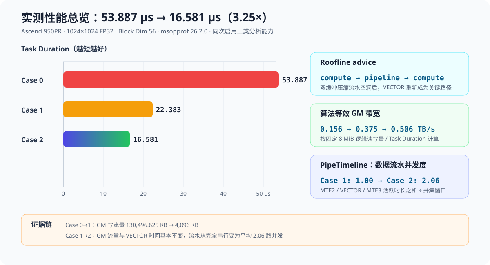
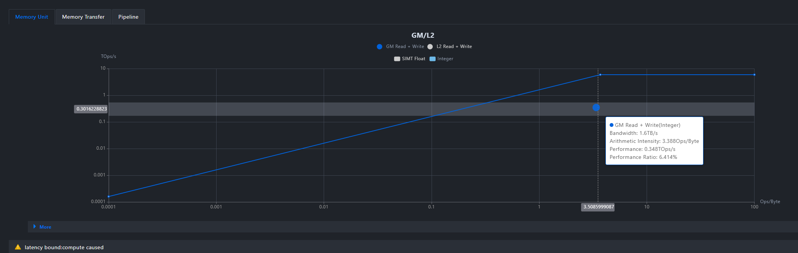
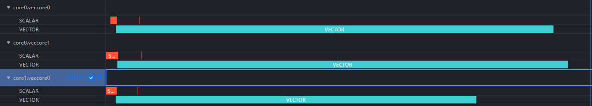
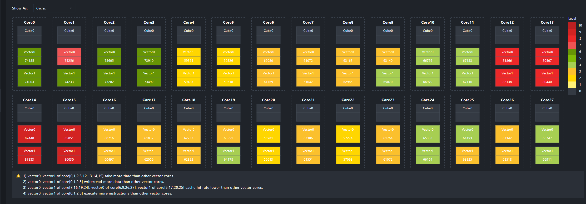
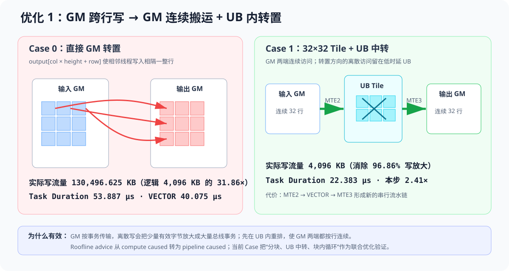
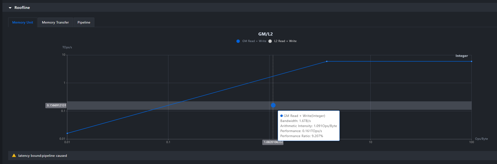
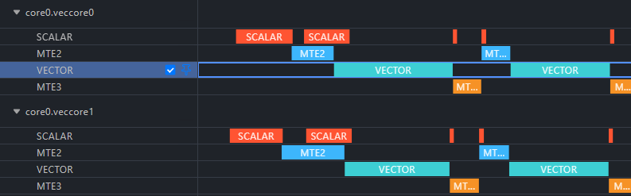
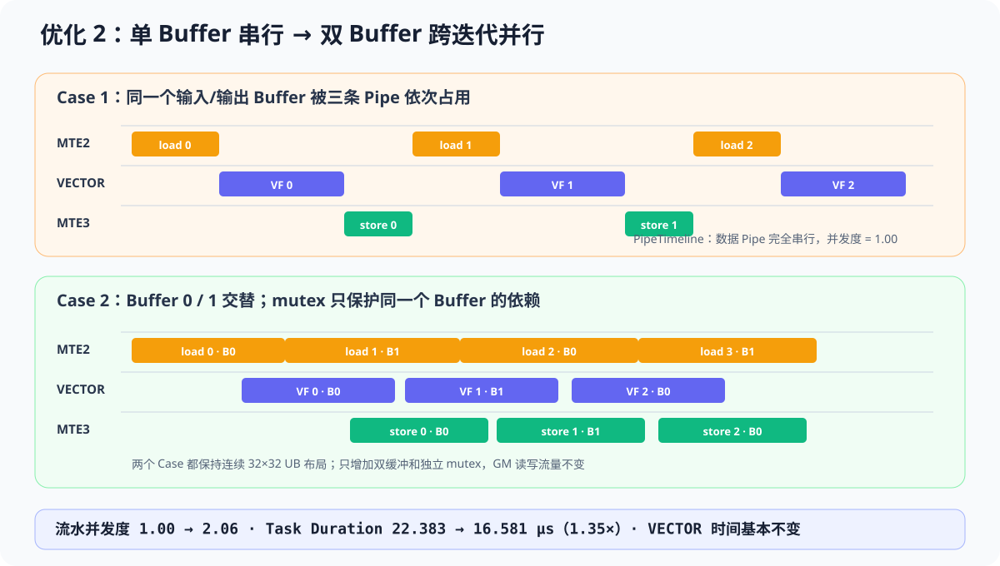

# SIMT+SIMD 混合算子上板优化分析案例（Matrix Transpose）

## 案例说明

本案例以 1024×1024 float 矩阵转置为例，演示如何用 `msopprof` 上板性能采集，逐步定位并优化 SIMT+SIMD 混合算子的瓶颈。算子数据通路为：MTE2 将 GM 数据搬入 UB，SIMT VF 在 UB 内完成转置方向访问，MTE3 将结果连续搬回 GM。案例共保留三个 Case：

| Case | 核函数                             | 本步引入的变化                                                                   | 输出二进制                 |
| ---- | ---------------------------------- | -------------------------------------------------------------------------------- | -------------------------- |
| 0    | `transpose_naive_kernel`         | 初始：SIMT VF 直接在 GM 上转置                                                   | `matrix_transpose_case0` |
| 1    | `transpose_ub_2tile_loop_kernel` | 引入 MTE 搬运、UB 中转和 32×32 分块，固定 Thread Block 数并循环处理多个 tile 组 | `matrix_transpose_case1` |
| 2    | `transpose_ub_2tile_db_kernel`   | 保持 32×32 连续 UB 布局，引入双缓冲和独立 mutex，使 MTE2/VF/MTE3 跨迭代重叠     | `matrix_transpose_case2` |

其中 `core` 为硬件 vector core 数（运行时通过 `aclrtGetDeviceInfo(ACL_DEV_ATTR_VECTOR_CORE_NUM)` 查询），`tiles` 为总 tile 数，1024×1024 矩阵对应 1024 个 32×32 tile。每个 Thread Block 启动 2048 线程，每轮处理 2 个 tile。

输入规模：

```text
input   [1024, 1024]    float   ND
output  [1024, 1024]    float   ND    output(x, y) = input(y, x)
```

## 编译运行

### 环境准备

请参照官方文档完成开发环境配置：[算子工具开发环境安装指导](https://gitcode.com/Ascend/msot/blob/master/docs/zh/common/dev_env_setup.md)。

### 编译算子

编译 Case 2（最新优化版）：

```bash
./build.sh 2
```

`build.sh` 参数顺序不敏感：

```text
./build.sh [0|1|2] [dav-3510] [npu|sim]
```

本案例默认运行模式为 `npu`，默认架构为 `dav-3510`（Ascend 950PR/950DT，该算子仅支持此架构），默认 Case 为 2。每个 Case 独立输出到 `build/case<N>_<run_mode>_<arch>/`，互不覆盖，便于对比采集。

### 算子运行

#### 拉起算子

采集上板性能数据时，可在一次运行中联合启用 Roofline、Occupancy 和 PipeTimeline。程序内部固定使用逻辑设备 1，因此 `ASCEND_RT_VISIBLE_DEVICES` 至少要提供两个物理设备；下例把逻辑设备 1 映射到物理设备 3。运行前请替换成实际空闲设备。二进制后的位置参数是矩阵边长，不是设备号。

```bash
for case_id in 0 1 2; do
    ASCEND_RT_VISIBLE_DEVICES=2,3 msopprof \
        --aic-metrics=Roofline,Occupancy,PipeTimeline,Default \
        --replay-mode=kernel \
        --output="build/results/case${case_id}" \
        "build/case${case_id}_npu_dav-3510/matrix_transpose_case${case_id}" 1024
done
```

运行前应确认 `msopprof_version.log` 中的版本与当前 CANN/算子兼容；本文实测使用 26.2.0。`Roofline` 会自动带上 Default PMU，因此同一结果目录还会生成七类基础 CSV。上板模式已经自动完成采集和解析，不需要再执行 simulator `--export`。

#### 查看采集结果

按下表逐项查看每个 Case 的采集结果，即可复现整条优化路径的判断依据：

| 文件                             | 观察目标                                                                  |
| -------------------------------- | ------------------------------------------------------------------------- |
| `OpBasicInfo.csv`              | `Task Duration`、`Block Dim`                                          |
| `PipeUtilization.csv`          | AIV 总时间、`vec`/`scalar`/`mte2`/`mte3` 各流水耗时与占比         |
| `ResourceConflictRatio.csv`    | 各流水冲突比例与`wait_ratio`；不能把字段直接等同为 SIMT UB subbank 冲突 |
| `Memory.csv`、`MemoryUB.csv` | GM/UB 读写带宽与数据搬运量                                                |
| `L2Cache.csv`                  | L2 读写命中率                                                             |
| `visualize_data.bin`           | Roofline 实际点、性能比例、Bound 判断和全核 Occupancy 明细                |
| `trace.json`                   | PipeTimeline 与 WarpTimeline；按`pid`/`tid` 过滤 Pipe 活跃区间        |

可视化界面注意：

- 在 MindStudio Insight 中导入各 Case 的 `visualize_data.bin`，切换 Roofline 和 Core Occupancy 页面，对比实际点、advice 和每核明细。
- 打开 `trace.json` 后按 `pid=coreN.veccoreM` 分组，并只看 `tid=SCALAR|VECTOR|MTE2|MTE3`，即可复核本文的流水重叠；Warp 事件与 Pipe 事件已合并在同一文件中，不能按事件总数直接计算 Pipe 占比。

## 性能分析

### 分析路径总览

| 能力         | 本例读取的数据                                                                    | 包含的信息                                                            |
| ------------ | --------------------------------------------------------------------------------- | --------------------------------------------------------------------- |
| Roofline     | `visualize_data.bin` 中的实际点、理论屋顶、`ratio` 和 `advice`；Default CSV | 当前点离理论上限多远；瓶颈属于 memory/compute/pipeline latency 哪一类 |
| Occupancy    | 每个 Vector Subcore 的 cycles、吞吐量、L2 命中率、SIMT 指令数和 CLI advice        | 核间是否均衡；尾块是否集中到少数核                                    |
| PipeTimeline | `trace.json` 中 SCALAR/VECTOR/MTE2/MTE3 的 `[ts, ts+dur)` 区间                | Pipe 的先后关系、空洞、两两与三路重叠                                 |

三个 Case 已重新独立编译，并在同一次环境中完成精度校验和联合采集。环境为 Ascend 950PR、1024×1024 FP32、Block Dim 56、`msopprof 26.2.0`。等效带宽按逻辑流量 8,388,608 B ÷ Task Duration 计算：

| Case | Task Duration (μs) | 本步加速 | 相对 Case 0 | 等效带宽 (TB/s) | Roofline advice                   |
| ---- | ------------------: | -------: | ----------: | --------------: | --------------------------------- |
| 0    |              53.887 |   1.00× |      1.00× |           0.156 | `latency bound:compute caused`  |
| 1    |              22.383 |   2.41× |      2.41× |           0.375 | `latency bound:pipeline caused` |
| 2    |              16.581 |   1.35× |      3.25× |           0.506 | `latency bound:compute caused`  |



下面逐轮展开：每轮先看优化前的 Roofline / Occupancy / PipeTimeline 数据、推出瓶颈，再讲优化原理，最后做优化前后对比。

### 优化一：把非连续访问从 GM 转移到 UB（Case 0 → Case 1）

#### 优化前现象：Case 0 瓶颈挖掘

Case 0 在 [`simt_transpose_naive`](matrix_transpose.asc) 中直接执行：

```cpp
output[col * height + row] = input[i];
```

相邻线程连续读取 `input[i]`，却跨输出矩阵的整行写入。逐项看采集数据：

**Roofline**：advice 为 `latency bound:compute caused`。这里的 `compute caused` 指 SIMT VF 这条计算 Pipe 导致的 latency bound，不是算力达到屋顶。优化大方向：先查访问行为，而不是堆算力。


转置的语义是「读一遍输入、写一遍输出」，因此理想逻辑流量 = `1024 × 1024 × 4 B = 4,096 KB`（读、写各一次，总计 8,192 KB）。Memory.csv / PipeUtilization.csv 的全核汇总显示写流量相对该基准严重放大，且 VECTOR 几乎占满全部时间：

| 指标                        |         Case 0 | 理想逻辑流量 |          放大倍数 |
| --------------------------- | -------------: | -----------: | ----------------: |
| `read_main_memory_datas`  |       4,103 KB |     4,096 KB |         约 1.00× |
| `write_main_memory_datas` | 130,496.625 KB |     4,096 KB | **31.86×** |

`vec_time` = 40.075 μs，`mte2`/`mte3` 时间接近 0。读流量正常而写流量放大 31.86 倍，与“跨输出矩阵整行写入”的代码完全对应：GM 以事务为单位传输，每个线程只有少量有效字节落入一个事务。

**PipeTimeline**：只有 VECTOR 活跃段，没有任何 MTE2/MTE3 数据搬运段。确认转置完全在 GM 上原地进行，不存在搬运流水可以利用。


**Occupancy**：部分核执行时间、读写量和指令数高于其他核，存在一定核间差异，但相对 31.86 倍的流量放大不是主要矛盾。


**瓶颈结论**：非连续 GM 写导致写流量放大 31.86 倍，这是 Case 0 的第一瓶颈。

#### 调优动作与原理

Case 1 使用 [`copy_gm_tile_to_ub`](matrix_transpose.asc) 中的 `asc_copy_gm2ub_align` 连续搬入 32×32 tile，在 UB 中通过 [`simt_transpose_2tile`](matrix_transpose.asc) 做转置访问，再由 `asc_copy_ub2gm_align` 连续写回。



GM 以事务为单位传输。直接跨行写时，每个线程只有少量有效字节落入一个事务，导致实际写流量显著放大；UB 中转后，离散方向只发生在片上存储，GM 两端都按二维连续块传输。

tile 边长取 32 是几个约束的交汇点：

- **线程映射**：每个 Thread Block 固定 2048 线程、每轮处理 2 个 tile，摊到每 tile 正好 1024 线程 = 32×32，一个线程处理一个元素；`tx = threadIdx.x`、`ty = threadIdx.y & 31`、`threadIdx.y >> 5` 选 tile 的位运算映射也依赖边长 32。
- **SIMT 执行宽度**：`threadIdx.x` 维度 32 是一个 SIMT 线程组的宽度，同组线程读 tile 一行即 32 个连续 float = 128 B。
- **MTE 对齐与 GM 事务**：一行 128 B 是 MTE 要求的 32 B 对齐的整数倍，GM 侧每次搬运 128 B 连续段也能填满事务。
- **UB 预算**：每个 32×32 tile 占 4 KB；每轮两块 tile 的输入和输出共 16 KB，双缓冲后共 32 KB。tile 更大则 UB 占用增加，更小则 MTE 搬运和 `asc_vf_call` 粒度过细。
- **整除性**：1024 / 32 = 32，两个方向都整除，共 1024 个 tile，无需边界分支。

#### 优化后性能对比

| 指标                  |             Case 0 |              Case 1 | 变化                        |
| --------------------- | -----------------: | ------------------: | --------------------------- |
| `Task Duration(us)` |             53.887 |              22.383 | **2.41×**            |
| GM 总流量             |     134,599.625 KB |            8,199 KB | 减少**93.91%**        |
| GM 写流量             |     130,496.625 KB |            4,096 KB | 减少 96.86%，回到逻辑下限   |
| `vec_time(us)`      |             40.075 |              12.750 | 减少 68.2%                  |
| Roofline advice       | `compute caused` | `pipeline caused` | 瓶颈转向流水延迟            |
| PipeTimeline 并发度   |             不适用 |                1.00 | MTE2→VECTOR→MTE3 完全串行 |

当前 Case 0→1 把“32×32 分块、UB 中转、MTE 搬运、固定块数并循环处理 tile 组”作为一个联合设计点。两者的 Block Dim 都是 56，因此本文可以证明整个设计点有效，但不能把收益继续拆分到这些子动作；若要分别量化，需要增加单独的消融 Case。

验证通过后，GM 流量已接近逻辑下限，但 Case 1 的 MTE2 → VECTOR → MTE3 仍严格串行，跨迭代流水空洞成为下一轮优化目标。

### 优化二：双缓冲隐藏流水延迟（Case 1 → Case 2）

#### 优化前现象：Case 1 瓶颈挖掘

**Roofline**：advice 为 `latency bound:pipeline caused`。GM 读/写为 4,103 KB / 4,096 KB，已经回到逻辑流量附近，瓶颈不在外存流量。


**PipeUtilization.csv**：`vec_time` = 12.750 μs、MTE2 = 4.137 μs、MTE3 = 2.328 μs，三条数据 Pipe 的 ratio 之和为 0.97。

**PipeTimeline**：[`transpose_ub_2tile_loop_kernel`](matrix_transpose.asc) 对同一组输入/输出 buffer 严格执行：


```text
MTE2 load → VECTOR transpose → MTE3 store
```

采样到的 12 个 Vector Subcore 上，三条数据 Pipe 的活跃区间没有重叠，并发度为 1.00。

**瓶颈结论**：单缓冲把同一迭代内的数据依赖扩展成了跨迭代串行，MTE2、VECTOR 和 MTE3 无法同时工作。

#### 调优动作与原理

Case 2 在 [`transpose_ub_2tile_db_kernel`](matrix_transpose.asc) 中定义两组连续的 32×32 输入/输出 UB buffer。每组输入、输出分别使用独立 mutex；当前 buffer 进入 VECTOR/MTE3 时，另一组 buffer 可以由 MTE2 搬入下一批 tile，只有复用同一 buffer 时才等待前一次消费者完成。



双缓冲没有改变 `simt_transpose_2tile` 的地址计算，也没有改变 GM 有效搬运量，因此 Case 1 → Case 2 是针对流水重叠的单变量实验。

#### 优化后性能对比

| 指标                     |       Case 1 单缓冲 |      Case 2 双缓冲 | 变化                             |
| ------------------------ | ------------------: | -----------------: | -------------------------------- |
| `Task Duration(us)`    |              22.383 |             16.581 | **1.35×**                 |
| `vec_time(us)`         |              12.750 |             12.933 | 基本不变，收益不来自 VECTOR 变快 |
| GM 读/写流量             |    4,103 / 4,096 KB |   4,103 / 4,096 KB | 完全不变                         |
| vec/mte2/mte3 ratio 之和 |                0.97 |               2.18 | 多条 Pipe 同时活跃               |
| PipeTimeline 平均并发度  |                1.00 |     **2.06** | 存在真实跨迭代重叠               |
| Roofline advice          | `pipeline caused` | `compute caused` | 流水空洞被压缩                   |

VECTOR 自身时间略增、GM 流量完全不变，但端到端缩短 25.9%；PipeTimeline 并发度同步从 1.00 提升到 2.06。因此收益可归因于跨迭代流水重叠。连续 32×32 UB 转置仍是主要计算开销，后续可继续针对 VF 地址计算和片上访问进行优化。

两轮优化将端到端耗时从 53.887 μs 降到 16.581 μs，总体提升约 3.25×。

### 数据有效性与限制

1. **PipeTimeline 是采样：** 本次每个 Case 的 `trace.json` 包含 core0～core5 的两条 Vector Subcore Pipe 轨迹；全核均衡结论来自 Occupancy，不能把 6 个采样核直接外推为全核时间。
2. **动态插桩警告：** 工具报告 `Some sub block may lose dynamic instrumentation data because sub blocks exceeding 108.`。三个 Case 都成功生成并解析 `timeline.bin.0`，本文只使用大尺度的串行/重叠关系，不据此对单条指令做结论。
3. **数据不可跨版本复用：** Case 编号、内核名或源码改变后必须重新编译和采集，不能把旧 Case 的数据直接套用到当前实现。
